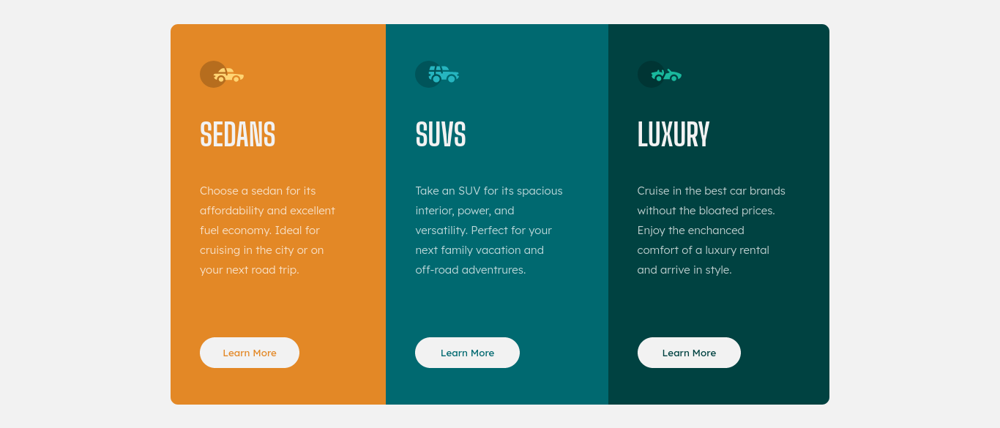

# Frontend Mentor - 3 Column Preview Card Component

## Overview

In this project I created a preview component containing three product cards. The preview supports desktop and mobile layouts with the help of flexbox.

### Screenshot

### Built with

- HTML 5
- CSS 3
- Flexbox

### What I learnt

Making this project reinforced the fundamental CSS concepts and responsive design considerations. It also helped me learn the proper way of setting the height of the *body* with *min-height: 100vh*.