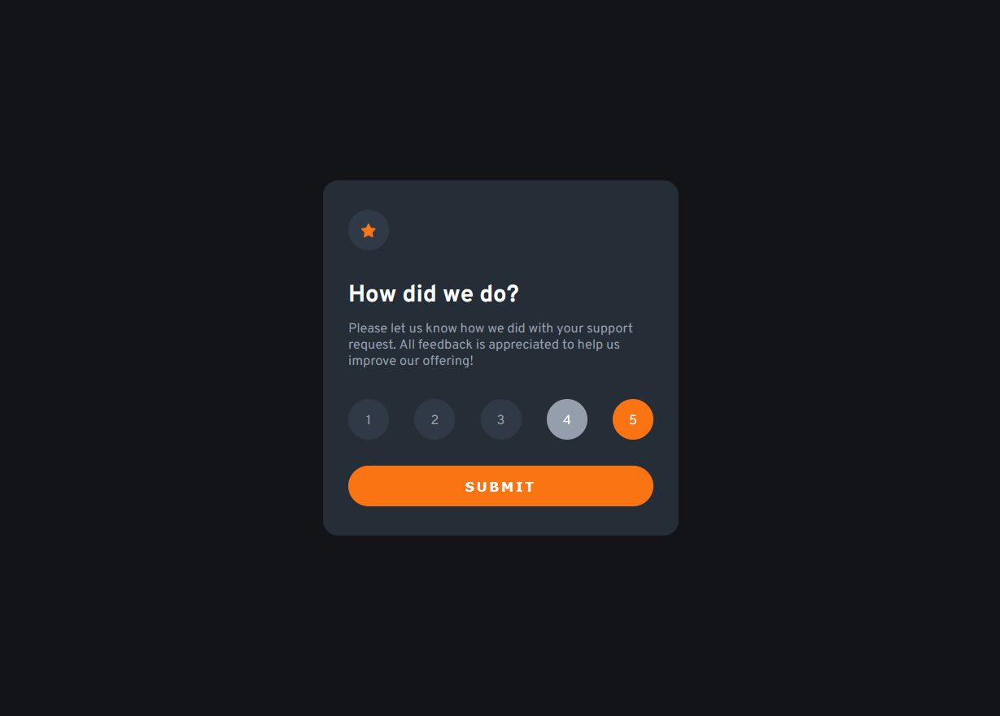

# Frontend Mentor - Interactive Rating Component

## Overview

In this challenge I created a component for rating a support service. The user can select the desired rating by clicking on the numbers. When the rating is submitted a thank you card will appear.

### Screenshot

### Built with

- HTML 5
- CSS 3
- Sass
- JavaScript

### What I learnt

Even though this was a quiet simple project it was perfect for returning to programming after a short break. Two of the concepts I practiced during the making of the component were the **Javascript Module Pattern** and the *@use* and *@forward* **Sass** keywords.