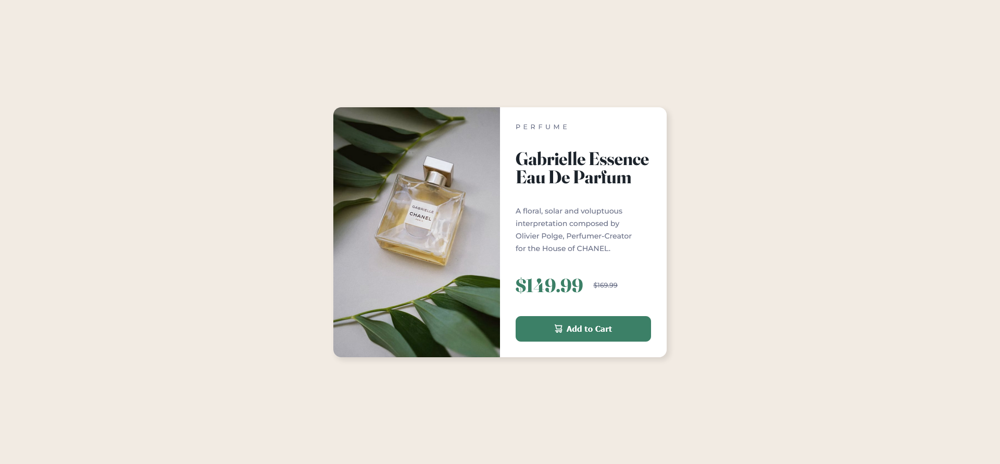

# Frontend Mentor - Product Preview Card Component

## Overview

My second Frontend Mentor challange. Slightly more complicated than the first one, but still pretty simple. I created a preview card for a perfume. It includes responsive design and a reactice button.

### Screenshot

### Built with

- HTML 5
- CSS 3
- Flexbox

### What I learnt

The project served as good practice for basic HTML and CSS. I also encountered some new things: the *\<picture>* HTML element, CSS media queries for responsive design, and pseudo classes (such as *:hover* and *:active*) for dynamic button styling.
