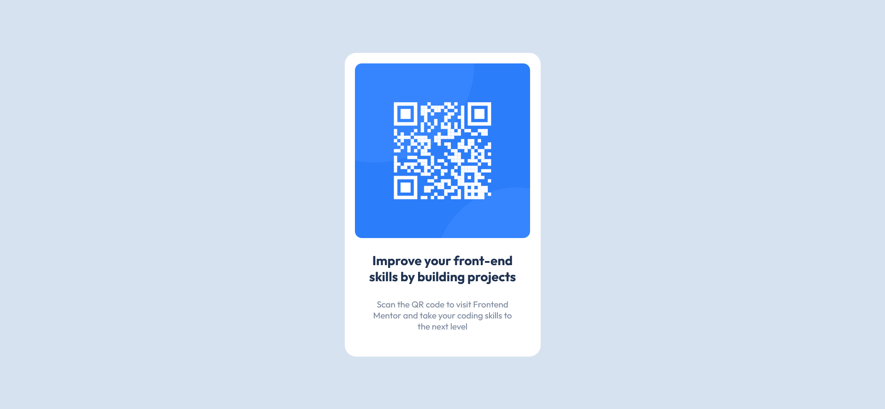

# Frontend Mentor - QR code component 

## Overwiev

This is my first Frontend Mentor challenge. During this exercise I created a very simple card for a QR code component as an introductinon to the Frontend Mentor experience.

### Screenshot

### Built with

- HTML5
- CSS3 
- Flexbox

### What I learnt

This project served as a quick refresher on CSS basics and helped me learn the difference between declaring rules in *html*, *\** and *:root*.