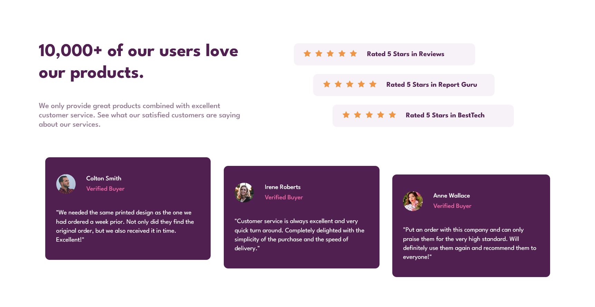

# Frontend Mentor - Social Proof Section

## Overview

In this challange I created a product review section with a *mobile first* approach. The section contains cards for ratings and testaments form users.

### Screenshot

### Built with

- HTML 5
- CSS 3
- Flexbox
- CSS Grid

### What I learnt

I used a *mobile first* approach during the project. This means that my media query for the desktop layout adds complexity to the design rather than removing it to reach a simpler, mobile layout. I also used CSS Grid to place the main sections on the desktop view and then controlled the flow of the smaller elements with Flexbox.